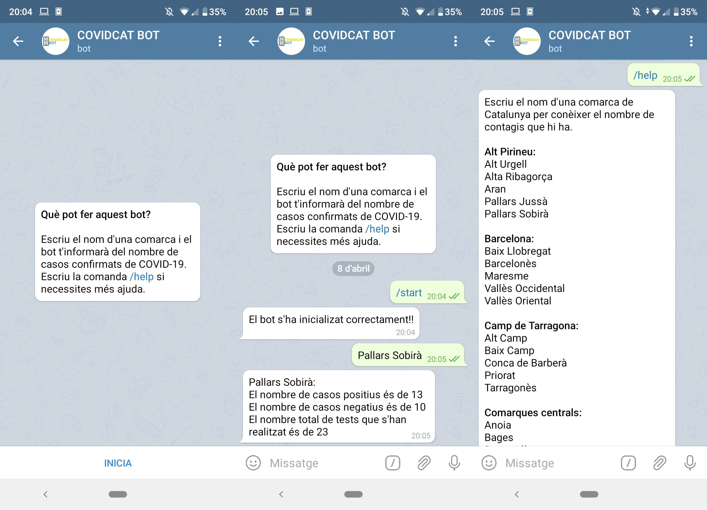

# COVIDCAT BOT

Telegram bot that gives information about COVID-19 tests and deaths in Catalonia. The bot receives a Catalan county or municipality and sends a message to the user with the positive and negative cases and total tests done ans deaths for counties.

You can test the bot following this link: [COVIDCAT BOT](https://t.me/CatalunyaCOVID19bot)

## Data

All data can be found at `dades obertes catalunya` in the [Tests](https://analisi.transparenciacatalunya.cat/Salut/Registre-de-casos-de-COVID-19-realitzats-a-Catalun/jj6z-iyrp/data) and [Deaths](https://analisi.transparenciacatalunya.cat/Salut/Registre-de-defuncions-per-COVID-19-a-Catalunya-Se/uqk7-bf9s/data) datasets. In case they are not available you can find a backup of both in this repository.

## Getting Started

These instructions will get you a copy of the project up and running on  your local machine for development and testing purposes.

### Prerequisites

You can install the necessary `python3` packages with:

```bash
$ pip3 install -r requirements.txt
```

### Running

You can run the bot with:

```bash
$ python3 src/covid-bot.py
```




## Build With

* [Telegram Bot](https://github.com/python-telegram-bot/python-telegram-bot)
* [Sodapy](https://pypi.org/project/sodapy/)


## Author

* **Guillem Pla Bertran** - [guillem.pla@est.fib.upc.edu]()
